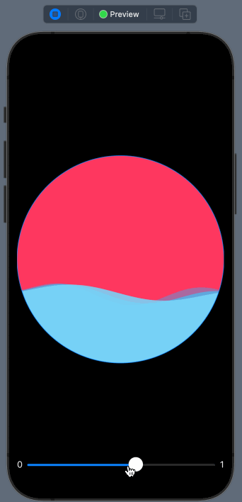

# WaveAnimation

---


A SwiftUI implementation of Wave animating shape.

## Preview

---




## Usage

---


```swift
improt SineWaveShape
SineWaveShape(percent: 0.4, strength: 30 * 0.9, frequency: 5 + 2, phase: 0)
                        .fill(color1)
                        .offset(y: CGFloat(1) * 1)
                        .animation(
                            Animation.linear(duration: duration).repeatForever(autoreverses: false)
                        )
```

## Customization like preview

---


```swift
import SwiftUI
import SineWaveShape

struct ContentView_Previews: PreviewProvider {
    static var previews: some View {
        ContentView(
            circleLineWidth: 1.0,
            strokeColor: .constant(Color.blue),
            color1: .constant(Color(#colorLiteral(red: 0.2392156869, green: 0.6745098233, blue: 0.9686274529, alpha: 1)).opacity(0.7)),
            color2: .constant(Color(#colorLiteral(red: 0.2588235438, green: 0.7568627596, blue: 0.9686274529, alpha: 1)).opacity(0.9)),
            color3: .constant(Color(#colorLiteral(red: 0.4745098054, green: 0.8392156959, blue: 0.9764705896, alpha: 1))))
            .preferredColorScheme(.dark)
    }
}

struct ContentView: View {
    @State var phase: Double = 0
    let frequency: Double = 5
    let duration: Double = 3
    let  strength: Double = 30
    @State var percent: Double = 0.3
    @State var circleLineWidth: CGFloat
    @Binding var strokeColor: Color
    @Binding var color1: Color
    @Binding var color2: Color
    @Binding var color3: Color
    
    var body: some View {
        VStack {
            Circle()
                .stroke(strokeColor, lineWidth: circleLineWidth)
                .background(
                    ZStack {
                        Color(.systemPink)
                        SineWaveShape(percent: percent, strength: strength * 0.9, frequency: frequency + 2, phase: self.phase)
                            .fill(color1)
                            .offset(y: CGFloat(1) * 1)
                            .animation(
                                Animation.linear(duration: duration).repeatForever(autoreverses: false)
                            )
                            .mask(
                                LinearGradient(gradient: Gradient(colors: [color1.opacity(0.7), color1]), startPoint: .top, endPoint: .bottom)
                            )
                        
                        SineWaveShape(percent: percent, strength: strength * 0.8, frequency: frequency + 1, phase: self.phase)
                            .fill(color2)
                            .offset(y: CGFloat(2) * 1)
                            .animation(
                                Animation.linear(duration: duration).repeatForever(autoreverses: false)
                            )
                            .mask(
                                LinearGradient(gradient: Gradient(colors: [color2.opacity(0.7), color2]), startPoint: .top, endPoint: .bottom)
                            )
                        
                        SineWaveShape(percent: percent, strength: strength * 0.7, frequency: frequency, phase: self.phase)
                            .fill(color3)
                            .offset(y: CGFloat(3) * 1)
                            .animation(
                                Animation.linear(duration: duration).repeatForever(autoreverses: false)
                            )
                            .mask(
                                LinearGradient(gradient: Gradient(colors: [color3.opacity(0.7), color3]), startPoint: .top, endPoint: .bottom)
                            )
                    }
                    .clipShape(Circle())
                    .onAppear(perform: {
                        phase = .pi * 2
                    })
            )
            Slider(value: $percent, in: 0...1, minimumValueLabel: Text("0"), maximumValueLabel: Text("1")) {
                
            }
        }
    }
}

```

## License

---


SineWaveShape is licensed under [MIT](https://github.com/MrChens/SineWaveShape/blob/main/LICENSE).

Copyright © 2021 IFunny. All Rights Reserved.
